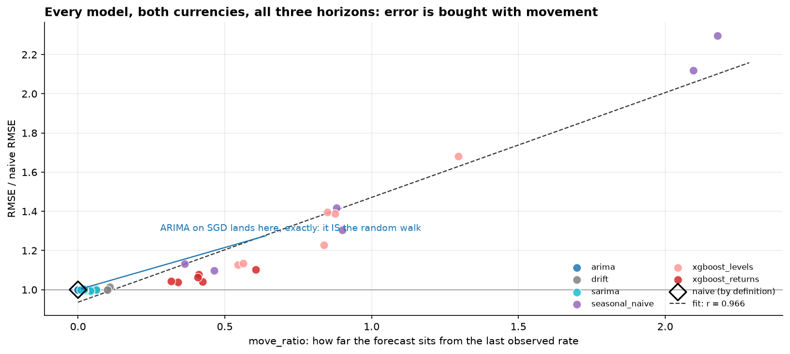
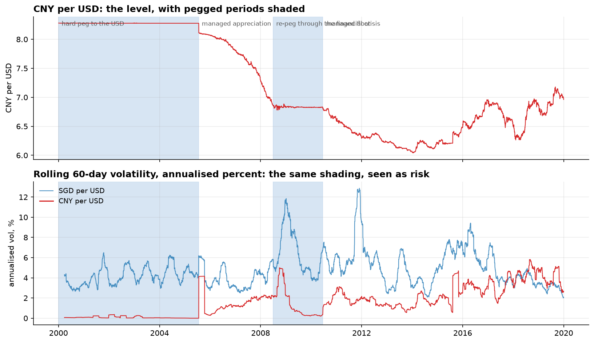
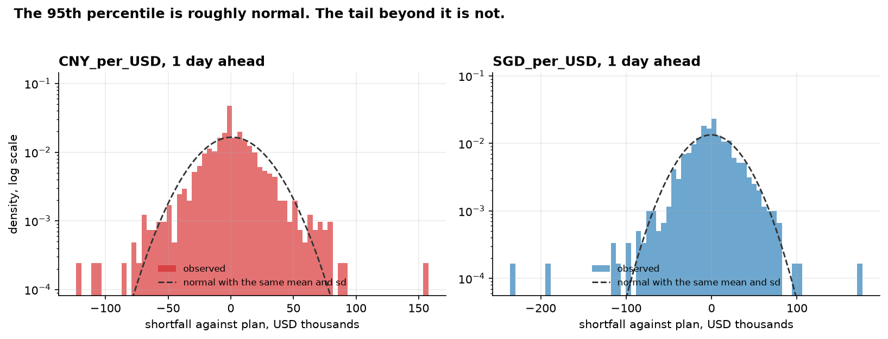

# FX Random Walk Benchmark

**Author:** Sergey Kasatov

**The question:** do ARIMA, SARIMA and XGBoost actually beat a random walk when forecasting daily
exchange rates, or do they just reproduce it?

**The answer: no, and one of them literally becomes it.** Across 42,924 forecasts on two currencies at
three horizons, not one model beat the naive "tomorrow equals today" forecast at any conventional
significance level. The error each model made turns out to be explained almost entirely - **r = 0.97** -
by how far it dared to move away from the last observed rate.

---

## Results

Walk-forward backtest, 1,022 forecast origins from January 2016 to December 2019, every model scored on
identical origins by identical code. `ratio` is the model's RMSE divided by the naive forecast's RMSE:
**1.00 is a tie with doing nothing, above 1.00 is worse than doing nothing.**

| | SGD/USD h=1 | SGD/USD h=5 | SGD/USD h=21 | CNY/USD h=1 | CNY/USD h=5 | CNY/USD h=21 |
|---|---|---|---|---|---|---|
| naive (random walk) | **1.0000** | **1.0000** | **1.0000** | **1.0000** | **1.0000** | **1.0000** |
| ARIMA | 1.0000 | 1.0000 | 1.0000 | 0.9998 | 1.0008 | 1.0005 |
| SARIMA | 1.0003 | 1.0014 | 1.0003 | 1.0001 | 0.9951 | 0.9942 |
| drift | 1.0000 | 0.9999 | 0.9982 | 1.0010 | 1.0044 | 1.0132 |
| XGBoost (returns, tuned) | 1.0127 | 1.0142 | 1.0519 | 1.0019 | 1.0073 | 1.0110 |
| XGBoost (returns) | 1.0425 | 1.0622 | 1.1033 | 1.0390 | 1.0791 | 1.0419 |
| XGBoost (levels) | 1.1272 | 1.1340 | 1.2288 | 1.6817 | 1.3872 | 1.3944 |
| seasonal naive | 2.1189 | 1.3057 | 1.0982 | 2.2976 | 1.4186 | 1.1330 |

The best result anywhere in the study is SARIMA on the yuan at 21 days: **0.58 percent better than doing
nothing, Diebold-Mariano p = 0.107.** That is not a result, it is a hint. Every other sub-1.00 cell is
smaller still.

Meanwhile several of the losses are significant at p < 0.01. Sophistication was not free here; it was
consistently paid for.

---

## The three findings worth reading the notebooks for

### 1. ARIMA did not tie the random walk, it became the random walk

The ARIMA order was chosen by AIC on the training window only. For the Singapore dollar, AIC picked
**(0, 1, 0)** - which *is* the random walk written in ARIMA notation.

The consequence is checkable and was checked: the fitted model's forecasts are **bit-identical** to the
naive forecast at every horizon and every origin, maximum absolute difference `0.000e+00`. The
Diebold-Mariano column is empty for those rows because comparing a forecast against itself has no verdict
to give, which is the behaviour `tests/checks.py` asserts.

Sixteen years of daily data were handed to a standard model selection procedure and it answered: *predict
no change.* The conclusion of this project was available from the AIC table before any backtest ran.

### 2. Error is bought with movement, at r = 0.97



For each model, `move_ratio` measures how far its forecast sits from the last observed rate, relative to
how far the truth sits from it. It is a measure of nerve, not of skill. Plotted against relative RMSE
across all 36 model / currency / horizon cells, the correlation is **0.966** (Spearman 0.872).

There is essentially no residual left for skill to live in. On this data a model is never rewarded for
being cleverer, only ever penalised for being braver.

### 3. Tuning helped, by making the model do less

The obvious objection to the gradient boosting result is that it was not tuned. So it was, with a grid
search on `TimeSeriesSplit` folds **inside the training window**, so the backtest period never voted on
the configuration that would later be scored against it.

The search chose the least capable corner of the grid on every axis, for both currencies: depth 2 of
{2, 4, 6}, learning rate 0.02 of {0.02, 0.05, 0.1}, 200 trees of {200, 400}. Asked how much model it
wanted, it answered "as little as you will let me have".

That closed most of the gap - from 4-10 percent worse to 0.2-5 percent worse - and it never wins. The
direction is the finding: tuning improved the model by moving it toward the naive forecast. Even inside
the training window, on time-respecting folds, the best configuration found still scored worse than
predicting no change (0.003416 against 0.003350 on SGD).

---

## Two findings in the data itself, before any modelling

**The brief that supplied this data describes the quote direction backwards.** It calls the Singapore
column "the exchange rate of 1 Singapore Dollar in US Dollars"; the values are around 1.65, and one
Singapore dollar has never been worth 1.65 US dollars. The series is Singapore dollars **per** US dollar.
Every interpretation flips on this: a rising line means the local currency getting weaker, not stronger.
The columns are renamed `SGD_per_USD` and `CNY_per_USD` so the unit travels with the data.

**The Chinese yuan series is four policy regimes, not one series.** In 2004 it took 11 distinct values in
262 trading days; in 2018 it took 224. Annualised volatility runs from 0.02 percent to 4.70 percent inside
the same column - a factor of over two hundred - because the yuan was hard-pegged to the dollar until July
2005 and re-pegged through the financial crisis.



A model trained across that is not learning how exchange rates behave, it is learning that this number
used to be constant. **This is why the backtest window starts in 2016**, where both currencies float. It
is not a convenience split.

Two more live in the notebooks: the missing-value marker `ND` falls on **US federal holidays**, which
dates the file to a US publisher rather than to either local market and settles how the gaps should be
filled; and the correlation between the two currencies is 0.96 on levels against 0.25 on returns, where
only the second answers the question "do they move together".

---

## What being wrong costs, in money

The brief asks for a risk assessment, so the measured errors are priced against a concrete exposure:
**USD 10,000,000 converted at the forecast horizon**, planned on the naive forecast. The numbers scale
linearly, so any other ticket size is a multiplication.

| Horizon | 5% adverse case, SGD | 5% adverse case, CNY | Worst observed, SGD | Worst observed, CNY |
|---|---|---|---|---|
| 1 day | -44,000 | -36,000 | -236,000 | -123,000 |
| 5 days | -111,000 | -91,000 | -233,000 | -171,000 |
| 21 days | -196,000 | -186,000 | -389,000 | -401,000 |

**The 95th percentile is roughly normal. The tail beyond it is not.**



The empirical 5 percent quantile sits within about ten percent of what a normal distribution predicts, so
a normal assumption is adequate for routine limit-setting. Then the worst single day on the Singapore
dollar turns out to be a **7.9 sigma** move - which a normal distribution rates at one occurrence every
2.4 trillion years of trading, and which happened inside a four-year sample. Excess kurtosis is 7.0 at the
daily horizon and falls to 0.0 at twenty-one days, so **the fat tail is a short-horizon problem**, which is
exactly the horizon at which a desk transacts.

**And the cost of choosing a model anyway**, on that same USD 10m ticket converted monthly:

| Choice instead of the naive forecast | Extra deviation per year, SGD | Extra per year, CNY |
|---|---|---|
| XGBoost on returns | +128,000 | +111,000 |
| XGBoost on levels | +249,000 | **+615,000** |

The irreducible cost of FX uncertainty on this exposure is about 1.13 million a year, and no model reduced
it. The levels model also widens the 5 percent worst case, from -196,000 to -255,000 on SGD, so the usual
defence that sophistication earns its keep in the extremes does not hold either.

## What a bank should actually do with this

1. **Do not buy or build a point forecast of the rate.** The one question to ask any vendor demonstrating
   an FX model is its RMSE ratio against a naive baseline, with a significance test attached. Everything
   here failed that test.
2. **Use the naive forecast as the planning number and spend the effort on the interval.** It is free,
   cannot be overfitted, carries no model risk, and was not beaten. The table above is the interval.
3. **Size the stress test off the empirical tail, not off a standard deviation.** A normal-based risk
   system rates the worst day in this sample as impossible.
4. **Point the modelling budget at volatility.** The size of the next move carries structure that its
   direction does not. On SGD a plain 60-day rolling estimate predicts next month's realised volatility at
   r = 0.62 and beats a constant assumption by 38 percent. On CNY it barely works, which is the limit of
   the claim rather than a detail to leave out.

The uncomfortable version, which is also the honest one: the correct deliverable for a brief asking for an
FX forecasting model is **a recommendation not to build one**, plus the measurement that justifies the
alternative and the price of ignoring it.

---

## Method, and the rules it does not break

| Rule | Why | Where |
|---|---|---|
| The naive baseline is built **before** any model | Otherwise there is nothing to compare against and any RMSE looks good | `src/models.py` |
| Expanding-window walk-forward, never a random split | A shuffled split on a time series trains on the future | `src/backtest.py` |
| Every feature at time t uses only data up to t | The one bug that would invalidate everything while making the results look better | asserted in `tests/checks.py` |
| Every model reported **against the baseline** | An absolute RMSE on a near random walk carries almost no information | `src/backtest.py` |
| Differences tested, not eyeballed | Diebold-Mariano with the Harvey small-sample correction | `src/metrics.py` |
| Model selection and tuning inside the training window only | Otherwise the test period votes on the model that is then scored against it | `src/models.py`, `src/tuning.py` |
| Horizons evaluated separately | Daily, weekly and monthly are different problems with different answers | 1, 5 and 21 trading days |

**The leakage check is mechanical rather than asserted.** `tests/checks.py` rewrites every observation
after a cut date, rebuilds the features, and requires the rows before the cut to be byte-identical. A
feature that reaches forward in time cannot survive that.

Seven checks, about a minute, no test-runner dependency:

```bash
python tests/checks.py
```

One of them exists because it caught a real bug. The Lo-MacKinlay variance ratio test is implemented from
the paper rather than taken from a library, and an early version was missing the `sqrt(n)` scaling. It
therefore never rejected the random walk for anything - which reads exactly like a clean result. It is now
calibrated against simulated series whose answer is known by construction: it must accept a simulated
random walk and reject simulated momentum.

---

## Repository

```
data/raw/            the source file, never modified, not committed
data/processed/      cleaned series and backtest output, not committed
notebooks/
  01_data_quality_audit.ipynb                 five findings, two of which contradict the brief
  02_eda_trend_seasonality_volatility.ipynb   the brief's four questions, plus "is this a random walk?"
  03_backtest_models_vs_random_walk.ipynb     the comparison, the risk assessment in money, the
                                              business conclusion and the limitations
src/
  data.py         loading and the cleaning decisions, each with its reason
  features.py     leak-free supervised framing, levels and returns
  models.py       the seven forecasters behind one interface
  metrics.py      RMSE, MAE, skill score, Diebold-Mariano
  diagnostics.py  ADF, Lo-MacKinlay variance ratio, Ljung-Box, weekday effects
  backtest.py     the walk-forward harness
  tuning.py       time-respecting hyperparameter search
  run_backtest.py, run_tuning.py
tests/checks.py   seven correctness checks, no dependencies
reports/          metrics, tuning grids and every figure, committed so the results are readable
                  without running anything
```

The notebooks are committed **with their outputs**, so every number and chart above is readable on GitHub
without installing anything.

## Reproducing

```bash
python -m venv .venv
.venv\Scripts\activate
pip install -r requirements.txt
python tests/checks.py
python src/run_backtest.py
python src/run_tuning.py
```

The walk-forward run is deterministic, so a rerun reproduces `reports/metrics.csv` exactly. It takes about
half an hour, for one specific reason that is documented rather than hidden: `statsmodels` re-filters the
whole series on every state update, so the two state-space models account for roughly 95 percent of the
runtime. Parameters are re-estimated every 63 trading days and the state is updated daily; refitting daily
would cost roughly forty times as much for a result that, given the winning specification is a random walk
with no parameters, is very unlikely to move.

## Data

Daily exchange rates from 2000-01-03 to 2019-12-31: 5,217 business days with not one weekday missing.
Singapore dollars per US dollar and Chinese yuan per US dollar. Supplied with a Finance brief. The raw
file is kept local and is not committed.

## Environment

Python 3.12, exact versions pinned in `requirements.txt`, full freeze in `requirements-lock.txt`.

## What this study does not claim

Only past prices were used. No interest rate differentials, no inflation, no positioning data - and
interest rate differentials in particular are the mechanism behind covered interest parity and would be
the first thing a serious attempt adds. The window is 2016 to 2019, which contains no crisis. Both
currencies are managed floats rather than free floats such as EUR or JPY, so neither result transfers
without being re-run.

The finding is therefore deliberately narrow, and it is exactly this: **on these two series, over this
window, using only past prices, none of ARIMA, SARIMA or XGBoost beat a random walk - and the error each
one made is explained almost entirely by how far it moved away from it.**
